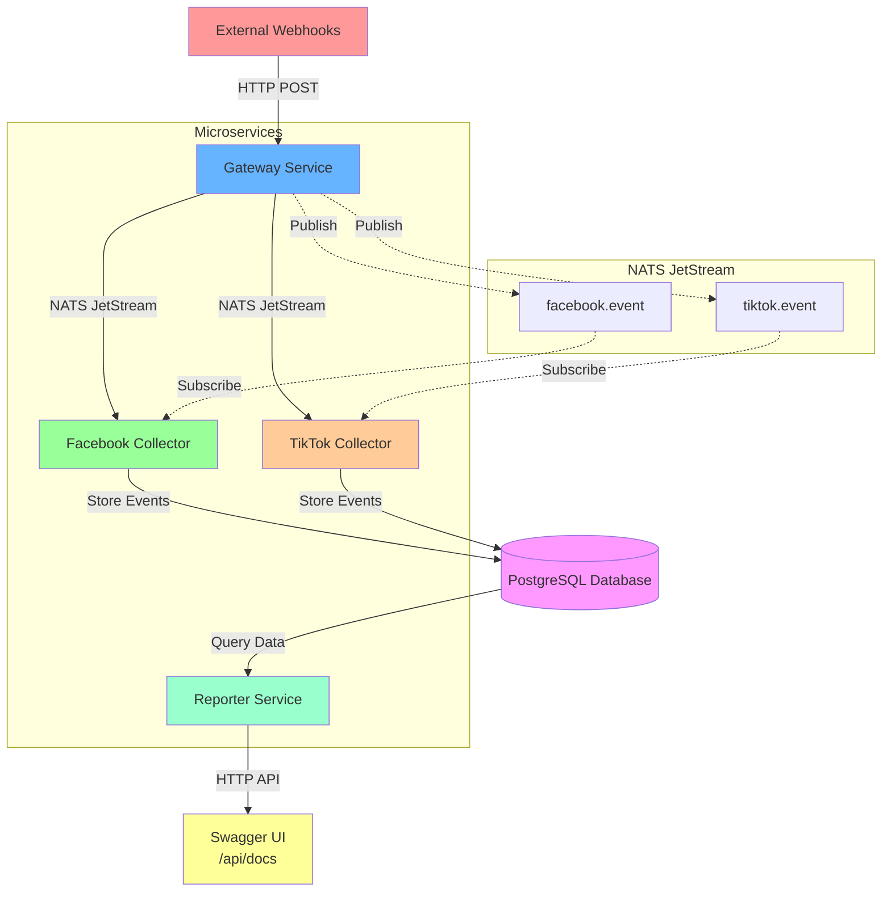

# Event-Driven Microservices Platform

A scalable event-driven microservices architecture for processing and analyzing social media events from Facebook and TikTok platforms using NATS JetStream message broker.

## Table of Contents

- [Architecture Overview](#architecture-overview)
- [Project Structure](#project-structure)
- [Services](#services)
- [Features](#features)
- [Prerequisites](#prerequisites)
- [Quick Start](#quick-start)
- [Development](#development)
- [Configuration](#configuration)
- [Message Flow](#message-flow)

## Architecture Overview



## Project Structure

```
event-processing-microservices/
├── common/
│   ├── database/           # Prisma schema and database utilities
│   └── types/              # Shared Zod schemas and TypeScript types
├── services/
│   ├── gateway/            # HTTP gateway for webhook ingestion
│   ├── facebook-collector/ # Facebook event processor
│   ├── tiktok-collector/   # TikTok event processor
│   └── reporter/           # Analytics and reporting API
├── docker-compose.yml      # Multi-service container orchestration
├── .env.example           # Environment variables template
├── nats.conf.example      # NATS server configuration template
└── package.json           # Workspace configuration
```

## Services

### Gateway Service
- **Purpose**: HTTP endpoint for receiving webhook events
- **Responsibilities**:
    - Validates incoming webhook payloads using Zod schemas
    - Routes events to appropriate NATS subjects based on source
    - Implements graceful shutdown for in-flight requests
    - Provides health check endpoints

### Facebook Collector
- **Purpose**: Processes Facebook events from NATS queue
- **Responsibilities**:
    - Subscribes to `facebook.event` NATS subject
    - Transforms Facebook event data
    - Stores processed events in PostgreSQL database
    - Implements durable consumer with explicit acknowledgments

### TikTok Collector
- **Purpose**: Processes TikTok events from NATS queue
- **Responsibilities**:
    - Subscribes to `tiktok.event` NATS subject
    - Transforms TikTok event data
    - Stores processed events in PostgreSQL database
    - Implements durable consumer with explicit acknowledgments

### Reporter Service
- **Purpose**: Analytics API for processed events
- **Responsibilities**:
    - Provides REST API for event analytics
    - Swagger/OpenAPI documentation at `/api/docs`

## Features

- **Event-Driven Architecture**: Decoupled services communicating via NATS JetStream
- **Graceful Shutdown**: Ensures no data loss during service restarts
- **Type Safety**: Shared TypeScript types and Zod validation schemas
- **Durable Messaging**: NATS JetStream ensures message delivery guarantees
- **Database Integration**: PostgreSQL with Prisma ORM
- **Container Ready**: Docker Compose for easy deployment
- **Workspace Management**: npm workspaces for efficient development
- **Health Monitoring**: Built-in health checks for all services

## Prerequisites

- Node.js 18+ and npm
- Docker and Docker Compose
- PostgreSQL (or use Docker setup)
- NATS Server (or use Docker setup)

## Quick Start

### 1. Clone and Install Dependencies

```bash
git clone https://github.com/dmykyr/event-driven-microservices.git
cd event-processing-microservices
npm install
```

### 2. Set Up Configuration

```bash
# Copy environment template
cp .env.example .env

# Copy NATS configuration template
cp nats.conf.example nats.conf

# Edit .env with your configuration
nano .env

nano nats.conf
```

### 3. Start with Docker Compose

```bash
# Start all infrastructure and services
docker-compose up -d

# Check service status
docker-compose ps
```

## Development

### Build Shared Packages

```bash
# Build type definitions
npm run build:types

# Watch mode for types during development
npm run dev:types
```

### Run Individual Services

```bash
# Gateway service
npm run start:gateway

# Facebook collector
npm run start:fb-collector

# TikTok collector
npm run start:ttk-collector

# Reporter service
npm run start:reporter
```

### Run All Services Together

```bash
# Start all services in development mode with colored output
npm run start:all

# Alternative command
npm run dev:all
```

### Build All Services

```bash
npm run build
```

### Run Tests

```bash
npm test
```

## Configuration

### Environment Variables (.env)
### NATS Configuration (nats.conf)

## Message Flow

1. **Event Ingestion**: Webhooks send events to Gateway service
2. **Validation**: Gateway validates payloads using Zod schemas
3. **Routing**: Events are published to platform-specific NATS subjects
4. **Processing**: Collector services consume and process events
5. **Storage**: Processed events are stored in PostgreSQL

### NATS Subjects

- `facebook.event` - Facebook platform events
- `tiktok.event` - TikTok platform events

## 📄 License

This project is licensed under the MIT License - see the [LICENSE](LICENSE) file for details.